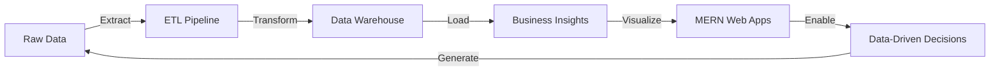

# 👨‍💻 Sakthivel R
## Data Architect × MERN Maestro

> *Turning raw data into business intelligence, then crafting the interfaces that make it actionable.*

<p align="center">
  
  
  
</p>

## 🧠 Core Expertise

```python
skills = {
    "data_engineering": ["ETL/ELT Pipelines", "Data Warehousing", "Stream Processing"],
    "web_development": ["MongoDB", "Express", "React", "Node.js"],
    "cloud_platforms": ["AWS S3", "AWS Glue", "AWS Redshift", "Firebase"],
    "data_tools": ["Apache Airflow", "Apache Spark", "Kafka", "dbt"],
    "impact": "10M+ daily records processed • 40% pipeline latency reduction"
}
```

## 🔧 Tech Arsenal

<p align="center">
  <kbd>
    <span title="Python"></span>
    <span title="SQL"></span>
    <span title="MongoDB"></span>
    <span title="AWS"></span>
    <span title="Spark"></span>
  </kbd>
  
  <kbd>
    <span title="JavaScript"></span>
    <span title="Node.js"></span>
    <span title="Express"></span>
    <span title="React"></span>
    <span title="Firebase"></span>
  </kbd>
</p>

## 🌟 What I Do



## 🚀 Career Highlights

* **Architected** real-time data pipelines handling 10M+ daily records
* **Engineered** ETL workflows reducing processing latency by 40%
* **Developed** full-stack MERN applications for data visualization & analysis
* **Implemented** cloud-native data solutions on AWS ecosystem

## 📫 Connect & Collaborate
<p align="center">
  <a href="mailto:sakthivelravi9894@gmail.com">
    
  </a>
  <a href="https://www.linkedin.com/in/sakthivel-r-351478297">
    
  </a>
  <a href="https://github.com/DeveloperSakthi">
    
  </a>
</p>

---

<p align="center"><i>"Data without action is just noise — I build the signal."</i></p>

<p align="center">⚡ <b>Fun Fact:</b> I can architect a data lake and debug React components in the same afternoon!</p>
